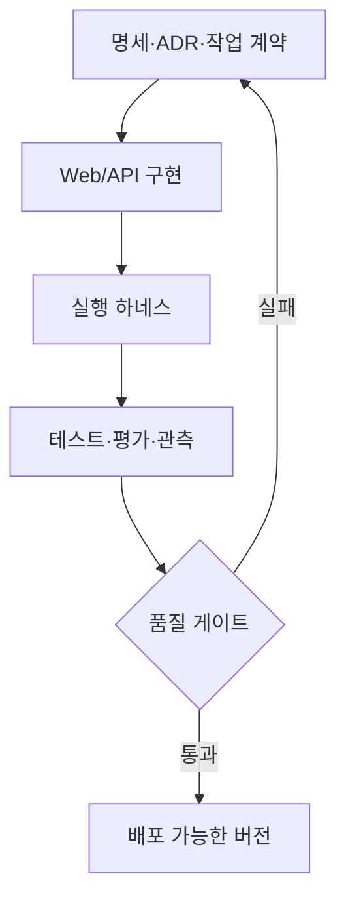
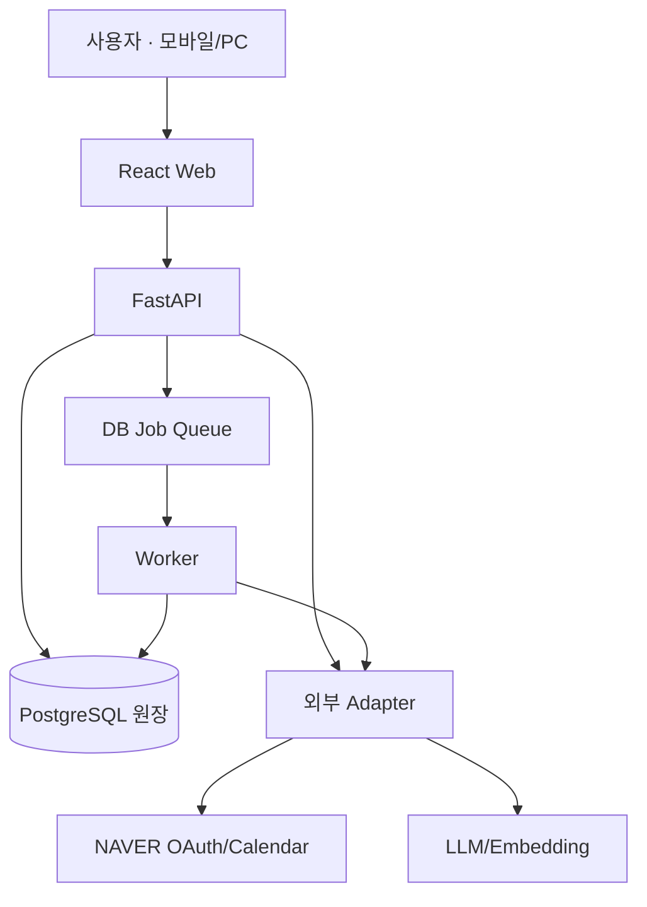
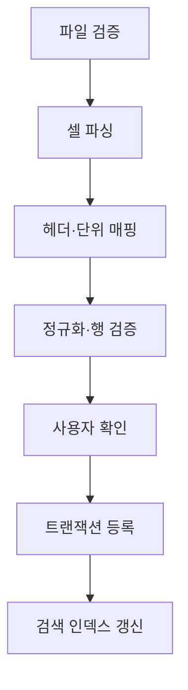
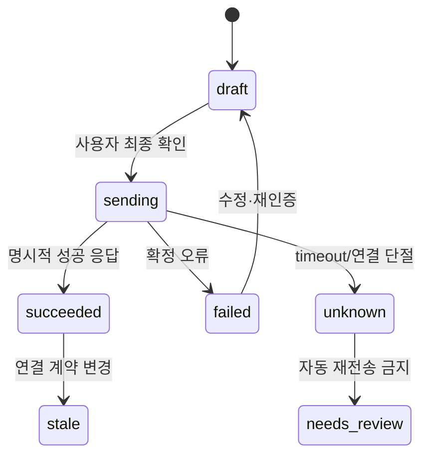
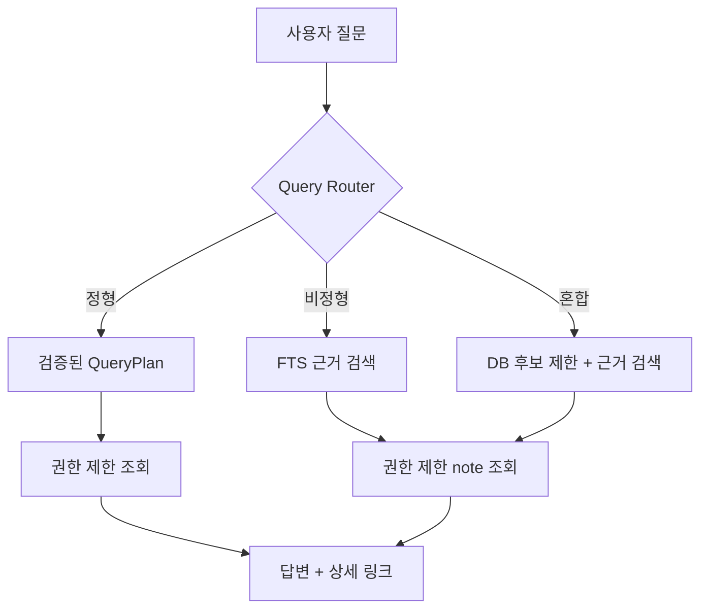
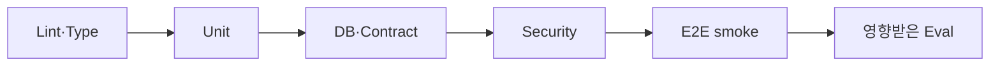

# 계약비서 하네스 구조 설계서 v0.1

> **명칭 정정**: 이 문서의 `계약비서` / `contract-secretary`는 **매물온 / `maemul_on`** 으로 대체되었다(2026-09-21 사용자 결정). [deprecated.md](../product/deprecated.md) 참조.
> **우선순위**: 이 문서는 기준 문서 4순위다. [requirements.md](../product/requirements.md)와 충돌하면 requirements.md가 이긴다.
> 이전 경로: 저장소 루트 `계약비서_하네스_구조_설계서_v0.1.md` (2026-09-21 이동)

- 작성일: 2026-09-21
- 대상: 1인 개발, 3주 MVP / 필요 시 6~8주 확장
- 기준 문서: `매물관리_요구사항_명세서_v0.4.md`
- 참고 자료: `매물온_프로젝트_공유메모.md`, `매물온_화면데모_v0.3.html`
- 문서 상태: 구현 전 설계안. 기술 스파이크와 사용자 검증 결과에 따라 ADR로 변경한다.
- 명칭: 이 문서에서는 제품명을 **계약비서**로 쓴다. 첨부 화면의 **매물온**은 같은 프로젝트의 기존 UI 가칭으로 취급한다.
- 2026-09-21 추가 반영: React.js·Zustand·Tailwind CSS, rem 기반 반응형 UI, 실제 마스킹 XLS 변칙 데이터, 셀 메모/관계자 정보, 개인용 범위, 중점/서브 아파트 뱃지, 직접 등록 CRUD.

---

## 0. 한눈에 보는 결론

계약비서의 하네스는 단순한 폴더 구조가 아니다. 다음 세 층이 서로 연결되어야 한다.

1. **개발 컨텍스트 하네스**: 요구사항, 결정, 금지사항, 작업 단위, 완료 조건을 AI 코딩 도구와 개발자가 동일하게 읽는다.
2. **제품 실행 하네스**: Excel 등록, 만기 계산, 조건 검색, 상담 검색, 캘린더 등록을 재현 가능한 파이프라인으로 실행한다.
3. **검증·관측 하네스**: 같은 fixture와 평가셋으로 정확도·권한·비용·지연·회귀를 비교하고 실패 증거를 남긴다.

핵심 원칙은 다음과 같다.

- 계약·고객·상담의 원장은 PostgreSQL이다. Excel, LLM, 검색 인덱스, 캘린더는 원장을 대체하지 않는다.
- Web은 React.js + TypeScript + Zustand + Tailwind CSS로 구현하고, 크기·간격·반응형 기준은 rem을 중심으로 관리한다.
- 날짜·가격·거래 유형·연락 상태는 결정적 코드와 허용된 Query DSL로 조회한다.
- LLM은 자연어를 제한된 구조로 변환하거나 근거를 요약한다. 임의 SQL과 무확인 쓰기는 금지한다.
- 챗봇이 없어도 만기 확인 → 연락 → 상담 기록 → 일정 등록의 핵심 업무를 완료할 수 있어야 한다.
- keyword/FTS를 상담 검색 baseline으로 먼저 구현한다. 임베딩·재검색은 고정 평가셋에서 개선이 확인될 때만 추가한다.
- 네이버 캘린더 실패가 계약·상담 저장을 롤백하지 않는다.
- 모든 데이터 접근은 서버가 세션의 `user_id`로 제한한다. 클라이언트나 모델이 전달한 소유자 ID를 신뢰하지 않는다.
- 제품은 공인중개사 **개인의 비공개 매물 관리 도구**다. 사무소 협업, 고객 공개, 매물 광고·공유 기능을 MVP에 넣지 않는다.
- 아파트는 사용자별로 `중점 / 서브 / 일반` 관리 등급을 갖고, 목록·상세에서 뱃지로 식별한다. 이는 권한 등급이 아니다.
- Excel 없이도 같은 데이터 계약을 사용하는 직접 등록·조회·수정·보관 처리가 가능해야 한다.



---

## 1. 하네스의 목표와 비목표

### 1.1 목표

- 새 채팅이나 새 코딩 세션에서도 제품 중심과 보안 경계를 잃지 않는다.
- 한 기능을 구현할 때 명세 → API 계약 → 테스트 → 평가 → 관측이 함께 갱신된다.
- 모델, 프롬프트, 검색 방식이 바뀌어도 동일한 데이터셋으로 전후 성능을 비교한다.
- 실제 고객 데이터 없이도 경계값, 실패, 사용자 격리, 중복 요청을 로컬과 CI에서 재현한다.
- 3주 MVP에 필요한 구조와 6~8주 확장 지점을 분리한다.
- 포트폴리오에서 “기술을 사용했다”가 아니라 “실패를 측정하고 선택을 바꿨다”를 증명한다.

### 1.2 비목표

- 모든 Excel 양식의 자동 변환
- Agentic RAG, GraphRAG, 멀티에이전트의 선제 도입
- 캘린더 전체 조회·삭제·양방향 동기화
- 챗봇을 통한 계약 수정 또는 외부 작업 자동 실행
- 사무소·직원·초대 기반 멀티테넌시
- Excel과 웹앱의 자동 양방향 동기화
- 운영 초기부터 마이크로서비스·Kubernetes·별도 벡터 DB를 도입하는 것

---

## 2. 설계 우선순위와 변경 규칙

충돌 시 아래 순서를 따른다.

1. 사용자의 최신 명시적 결정
2. 요구사항 명세서 v0.4
3. 승인된 ADR
4. 이 설계서
5. 프로젝트 공유 메모
6. 기존 화면 데모
7. 구현 편의 또는 AI 도구의 제안

요구사항과 다른 구현이 필요하면 코드를 먼저 바꾸지 않는다. `docs/decisions/ADR-xxxx-*.md`에 문제, 선택지, 결정, 영향, 되돌림 조건을 기록한 뒤 요구사항과 테스트를 함께 갱신한다.

### 2.1 반드시 유지할 제품 불변식

| ID | 불변식 | 자동 검증 위치 |
|---|---|---|
| INV-01 | 홈 만기 목록은 중점·서브·일반 등 모든 관리 등급의 내 매물을 포함한다. | 날짜/조회 통합 테스트 |
| INV-02 | 오늘부터 달력 기준 3개월 뒤까지 양 끝을 포함하며 고정 90일을 쓰지 않는다. | 도메인 단위 테스트 |
| INV-03 | 연락 완료여도 만기 목록에서 자동 제거하지 않는다. | 조회 회귀 테스트 |
| INV-04 | 예상 날짜와 누락 날짜를 확정값처럼 표시하거나 답하지 않는다. | API·챗봇 평가 |
| INV-05 | 고객 이름만으로 고객·계약을 자동 병합하지 않는다. | import/도메인 테스트 |
| INV-06 | 다른 로그인 사용자의 자료는 API·검색·인용·파일·캘린더 어디에서도 노출하지 않는다. | 보안 계약 테스트 |
| INV-07 | 챗봇은 MVP에서 읽기 전용이며 임의 SQL을 실행하지 않는다. | 라우터 스키마·API 테스트 |
| INV-08 | 캘린더 실패는 계약·상담 저장과 기본 조회를 막지 않는다. | 장애 주입 테스트 |
| INV-09 | Excel 재시도·중복 클릭이 중복 원장을 만들지 않는다. | idempotency 테스트 |
| INV-10 | 검색 실패를 실제 매물 부재로 단정하지 않는다. | 응답 정책 평가 |
| INV-11 | 서비스는 로그인한 공인중개사 개인의 비공개 자료만 관리하며 공개·공유 URL을 만들지 않는다. | route·권한 테스트 |
| INV-12 | Excel의 원문 값·셀 메모를 보존하고, 불확실한 금액·날짜·관계자를 자동 확정하지 않는다. | import fixture 테스트 |
| INV-13 | 중점/서브/일반 뱃지는 사용자별 관리 편의이며 데이터 접근 권한으로 사용하지 않는다. | 도메인·보안 테스트 |
| INV-14 | 직접 등록과 Excel 등록은 동일한 canonical schema와 validation을 통과한다. | API contract 테스트 |

---

## 3. 권장 기술 기준선

| 영역 | MVP 기준선 | 선택 이유 | 확장 조건 |
|---|---|---|---|
| Web | React.js + TypeScript + Vite | 요청된 기술 기준, SPA 업무 화면과 빠른 로컬 개발 | SSR이 실제로 필요해질 때만 재검토 |
| Client state | Zustand | import/direct CRUD의 단계·draft·필터 UI 상태 관리 | 서버 원장 데이터는 별도 query/cache 계층 유지 |
| UI | Tailwind CSS + 접근 가능한 headless component | rem 기반 token, 반응형, 일관된 상태 표현 | 디자인 시스템이 커질 때 별도 패키지 |
| API | FastAPI + Python | Excel·LLM·평가 생태계와 적합 | 현재 유지 |
| 검증 모델 | Pydantic | API·LLM 출력·설정의 단일 검증 방식 | 현재 유지 |
| ORM/마이그레이션 | SQLAlchemy 2 + Alembic | 명시적 트랜잭션과 변경 이력 | 현재 유지 |
| DB | PostgreSQL | 원장, FTS, JSON, 잠금, 추후 pgvector 지원 | semantic 검색 채택 시 pgvector extension |
| 파일 | 개발 로컬 저장 / 운영 private object storage | 원본 Excel 분리와 삭제 정책 | 배포 환경 확정 시 provider 선택 |
| 비동기 작업 | PostgreSQL job table + 별도 worker | Redis 없이 재시도·상태·재기동 복구 | 처리량 증가 시 Redis 기반 큐 검토 |
| 테스트 | pytest, Vitest, Playwright | 도메인·계약·UI를 분리 검증 | 현재 유지 |
| API 타입 | OpenAPI → TypeScript 생성 | 프런트/백 계약 드리프트 방지 | 현재 유지 |
| 관측 | 구조화 로그 + trace ID + DB job/event 기록 | 개인정보를 남기지 않고 실패 추적 | 사용량 증가 시 OpenTelemetry/Sentry |

### 3.1 MVP에서 의도적으로 두지 않는 것

- Redis: 현재 규모에서는 운영 부품만 늘어난다.
- 별도 벡터 DB: PostgreSQL FTS baseline 결과가 나오기 전에는 필요성이 없다.
- LangGraph: 읽기 전용의 짧고 고정된 분기에는 일반 함수/서비스가 더 명확하다.
- 메시지 브로커: import/index 작업량과 복구 요구가 PostgreSQL job table을 넘을 때 검토한다.
- 복수 LLM provider 추상화: 첫 모델을 검증하기 전부터 공통분모 API를 만들지 않는다. 단, 호출부는 adapter 한 곳에 격리한다.
- SSR 프레임워크: 현재 제품은 로그인 후 사용하는 개인 업무 SPA이므로 MVP에는 필요하지 않다.

---

## 4. 전체 시스템 구조



### 4.1 경계

- **Web**: 표현, 입력 상태, 접근성, 사용자 확인. 비즈니스 권한 판단은 하지 않는다.
- **API**: 인증 사용자 확인, 입력 검증, 도메인 규칙, 트랜잭션, 외부 호출 orchestration.
- **PostgreSQL**: 계약·고객·상담·분류·변경 이력·job·외부 요청 상태의 원장.
- **Worker**: Excel 파싱, 검색 인덱싱, 오래 걸리거나 재시도 가능한 작업.
- **External adapters**: 네이버와 LLM의 스펙·오류를 내부 도메인 오류로 번역한다.
- **Eval runner**: 운영 API와 같은 도메인 함수를 fixture에 실행하되 외부 쓰기는 fake adapter로 차단한다.

### 4.2 배포 단위

MVP의 코드 저장소는 monorepo 하나, 배포 단위는 최대 세 개로 둔다.

1. `web`: React.js + Vite 정적 bundle
2. `api`: FastAPI
3. `worker`: API와 같은 Python 패키지를 사용하되 별도 프로세스로 실행

DB와 object storage는 관리형 서비스를 사용한다. `api`와 `worker`가 같은 도메인 코드를 공유하므로 로직 복제를 피한다.

---

## 5. 저장소와 개발 컨텍스트 하네스

```text
contract-secretary/
├─ AGENTS.md
├─ README.md
├─ Makefile
├─ .env.example
├─ apps/
│  ├─ web/
│  │  ├─ app/
│  │  ├─ components/
│  │  ├─ features/
│  │  └─ tests/
│  └─ api/
│     ├─ src/contract_secretary/
│     │  ├─ api/
│     │  ├─ auth/
│     │  ├─ domain/
│     │  ├─ imports/
│     │  ├─ search/
│     │  ├─ chat/
│     │  ├─ calendar/
│     │  ├─ jobs/
│     │  ├─ observability/
│     │  └─ adapters/
│     ├─ migrations/
│     └─ tests/
├─ packages/
│  ├─ api-client/
│  └─ ui/
├─ ai/
│  ├─ prompts/
│  ├─ schemas/
│  ├─ providers/
│  └─ policies/
├─ evals/
│  ├─ datasets/
│  ├─ fixtures/
│  ├─ graders/
│  ├─ reports/
│  └─ run.py
├─ tests/
│  ├─ contract/
│  ├─ security/
│  └─ e2e/
├─ docs/
│  ├─ product/
│  ├─ architecture/
│  ├─ decisions/
│  ├─ runbooks/
│  └─ tasks/
├─ scripts/
│  ├─ bootstrap.sh
│  ├─ generate-api-client.sh
│  ├─ seed-demo.sh
│  ├─ check-no-secrets.sh
│  └─ verify.sh
└─ infra/
   ├─ docker-compose.yml
   └─ deploy/
```

### 5.1 `AGENTS.md`의 역할

루트 `AGENTS.md`는 긴 기획서를 복사한 문서가 아니라 **작업 라우터**다. 150~250줄 안에서 다음만 유지한다.

- 제품 중심 한 문단
- 기준 문서와 우선순위
- INV-01~10 요약
- 명령어: 설치, 개발, 테스트, 평가, 마이그레이션
- 폴더별 책임
- 금지사항: 임의 SQL, 사용자 ID 신뢰, 무확인 외부 쓰기, PII 로그, 테스트 삭제로 통과시키기
- 작업 전 읽어야 할 문서의 경로
- 완료 전 반드시 실행할 `make verify`

세부 도메인 규칙을 모두 `AGENTS.md`에 중복하지 않는다. 중복은 오래된 규칙을 남긴다.

### 5.2 작업 계약서

기능마다 `docs/tasks/TASK-xxxx.md`를 만들고 다음 형식을 사용한다.

```md
# TASK-xxxx 제목

## 사용자 결과
사용자가 무엇을 할 수 있게 되는가?

## 범위 / 제외 범위
- 포함:
- 제외:

## 관련 요구사항·불변식
- Fxx, INV-xx

## 변경 가능한 경로
- apps/api/...
- apps/web/...

## API·데이터 계약
- 요청/응답/오류/권한

## 수용 예시
- Given / When / Then

## 검증 명령
- make test-unit
- make test-contract
- make eval-...

## 증거
- 테스트/리포트/스크린샷 경로
```

AI 코딩 도구에는 전체 프로젝트 대화를 매번 넣는 대신 해당 task, 연결된 요구사항, 영향을 받는 ADR만 제공한다.

### 5.3 완료의 정의

기능 완료는 코드가 실행되는 것만을 뜻하지 않는다.

- 요구사항 ID 또는 ADR과 연결됨
- 입력/응답/오류 schema가 있음
- 소유권 필터가 서버에 있음
- 정상·경계·실패 테스트가 있음
- 로그에 PII가 없는지 확인됨
- UI의 loading/empty/error/success 상태가 있음
- 관련 평가셋 또는 fixture가 추가됨
- OpenAPI client가 재생성되었고 diff가 검토됨
- `make verify`가 통과함
- 측정하지 않은 개선 수치를 문서에 쓰지 않음

### 5.4 AI 코딩 작업 루프

각 작업 세션은 아래 순서를 고정한다.

1. **Read**: `AGENTS.md` → 해당 TASK → 연결된 요구사항/ADR → 수정 대상 코드 순서로 읽는다.
2. **Plan**: 바꿀 경로, 유지할 불변식, 추가할 테스트, 위험한 외부 작업을 짧게 적는다.
3. **Implement**: task 범위 안에서 가장 작은 end-to-end slice를 구현한다.
4. **Verify**: 가까운 unit test부터 실행하고 마지막에 task의 검증 명령과 `make verify`를 실행한다.
5. **Review**: diff에서 권한 필터, PII 로그, 날짜 직접 계산, schema 우회, 무확인 외부 쓰기를 검색한다.
6. **Record**: 결과와 남은 실패를 TASK에 기록하고, 설계가 바뀌었다면 ADR을 추가한다.

한 번에 여러 기능을 맡기지 않는다. “홈 전체 구현”보다 “만기 도메인 함수 → API → 카드 1개 → 경계 E2E”처럼 수직 조각으로 진행한다. AI가 만든 설명이 아니라 실행한 테스트와 diff가 완료 증거다.

---

## 6. 데이터 원장과 최소 모델

### 6.1 핵심 엔터티

| 엔터티 | 핵심 필드 | 규칙 |
|---|---|---|
| `users` | id, naver_subject, status, created_at | 이름·이메일로 병합하지 않는다. |
| `oauth_tokens` | user_id, encrypted_access, encrypted_refresh, expires_at | 암호화·접근 제한·폐기 상태를 둔다. |
| `apartments` | id, owner_user_id, canonical_name, aliases, management_tier | `primary / secondary / general`; 사용자별 관리 뱃지이며 권한 경계가 아니다. |
| `properties` | id, owner_user_id, apartment_id, building, unit, unit_type_raw, unit_type_normalized | 동·호·타입 원문을 보존한다. 아파트가 아닌 매물도 허용한다. |
| `listings` | id, property_id, deal_type, sale_price_krw, deposit_krw, monthly_rent_krw, amount_raw, parse_status | 팔려는/내놓은 조건. 원문과 정규화 값을 함께 둔다. |
| `contracts` | id, property_id, contract_type, deposit_krw, monthly_rent_krw, start_date, expiry_date, expiry_certainty, status, version | 실제 점유·임대차 계약. 매매 등록과 분리하고 갱신 이력을 보존한다. |
| `customers` | id, owner_user_id, display_name | 이름만으로 자동 병합하지 않는다. |
| `contact_points` | id, customer_id, phone_encrypted, label, is_primary, source_ref | 한 셀의 여러 번호를 각각 저장하고 `딸/아들/배우자/대리인` 등의 원문 label을 보존한다. |
| `contract_parties` | contract_id, customer_id, role, relationship_note | 임대인·임차인·명의자·대리인과 가족 관계를 구분한다. |
| `consultation_notes` | id, contract_party_id, body_encrypted, occurred_at, created_by | 검색용 파생값과 원문을 구분한다. |
| `contact_events` | id, contract_party_id, outcome, occurred_at, note_id | 시도와 해결을 동일시하지 않는다. |
| `import_jobs` | id, owner_user_id, file_hash, status, mapping_version | 재시도와 중복 등록을 제어한다. |
| `import_rows` | job_id, sheet_name, row_no, source_json_encrypted, candidate_json, issues_json, resolution | 원문·후보·확정값을 구분하고 셀 위치를 검토 화면에 연결한다. 원문 접근은 import 검토 경로로 제한한다. |
| `source_annotations` | import_row_id, cell_ref, text_encrypted, annotation_type | 셀 메모·주석을 숨은 정보로 버리지 않고 출처와 함께 보존한다. |
| `property_notes` | id, property_id, category, body_encrypted, source_ref | 특이사항·비고를 관계자/금액/공동중개 정보와 구분 가능한 형태로 보존한다. |
| `calendar_requests` | id, owner_user_id, contract_id, request_version, ical_uid, status | 성공·실패·불명을 구분한다. |
| `audit_events` | actor_user_id, action, entity_type, entity_id, changed_fields, trace_id | 원문과 토큰은 기록하지 않는다. |

`listings`와 `contracts`를 분리하는 이유는 예시 XLS에서 `매매` 행의 금액 셀에 월세형 `보증금/월세`가 들어가거나, 매매 매물의 특이사항에 현재 전세금이 기록된 사례가 있기 때문이다. 이를 하나의 `trade_type + amount`로 저장하면 “팔려는 조건”과 “현재 임대차 조건”을 잘못 합칠 수 있다.

### 6.2 소유권 규칙

모든 조회는 repository/service가 현재 인증 세션에서 얻은 `owner_user_id`를 인자로 요구한다.

```python
# 허용되는 형태
get_contract(session_user_id, contract_id)

# 금지되는 형태
get_contract(contract_id)
get_contract(request.body.user_id, contract_id)
```

가능하면 DB repository의 public method에서 `owner_user_id` 없는 조회 함수를 제공하지 않는다. 관리자 기능이 필요해지면 일반 경로와 분리된 명시적 인터페이스를 만든다.

### 6.3 변경 이력

- 계약 갱신은 기존 row를 덮어쓰는 대신 `contract_revisions` 또는 audit snapshot으로 이전 값을 남긴다.
- 상담 메모의 수정/삭제 정책을 분리한다. UI 삭제와 법적 보관 여부는 제품 정책 확정 전 hard delete로 단정하지 않는다.
- Excel 원본, import staging, 검색 파생 데이터는 서로 다른 retention을 가진다.
- 달력 일정은 계약의 복제본이지 원장이 아니다.

---

## 7. 핵심 실행 하네스

### 7.1 Excel 등록 파이프라인



단계별 입력과 출력은 Pydantic schema로 고정한다.

1. `FileInspection`: 확장자, MIME, 크기, 암호화/손상 여부, sheet 목록
2. `ParsedWorkbook`: 셀 값과 위치. 수식·매크로는 실행하지 않는다.
3. `MappingProposal`: 원본 header → canonical field, confidence, reason
4. `NormalizedRow`: 날짜, 금액, 거래 유형, 고객 역할 등 표준값
5. `RowIssue`: `missing`, `ambiguous`, `invalid`, `conflict`, `duplicate_candidate`
6. `ImportPreview`: 자동 처리 가능 행과 사용자 확인 필요 행
7. `ImportCommit`: 사용자 수정값, preview version, idempotency key

#### 예시 XLS에서 관찰한 입력 프로필

아래 수치는 제공된 `매물관리_마스킹.xls`만의 특성이다. 시장 전체 양식의 통계로 일반화하지 않는다.

| 관찰 항목 | 확인 내용 | 설계 영향 |
|---|---|---|
| 시트 | `고객관리`, 중점 단지로 보이는 개별 단지 시트, `타단지아파트` | 시트 이름만으로 관리 등급을 자동 확정하지 않고 후보로 제안 |
| 실제 매물 행 | 두 매물 시트에서 약 123개 비어 있지 않은 행 | 빈 서식 행 1만여 개를 실제 데이터로 처리하지 않음 |
| 금액 | 숫자형 외 `3천/130`, `1억5천/60`, `13,500/60`, 빈 값 | 원문 보존, 단위 해석, 두 금액 분리, 확인 상태 필요 |
| 거래 의미 | `매매` 행에 월세형 금액이 있거나 특이사항에 전세금이 있음 | listing과 실제 contract를 분리하고 자동 덮어쓰기 금지 |
| 날짜 | Excel serial, `2023년7월8일`, `2023-09~2025.09`, 빈 값 | 날짜 후보·기간 후보·확실성·원문을 별도 관리 |
| 연락처 | 한 셀에 여러 번호와 딸·아들·부인·남편 등의 label | 반복 가능한 관계자/연락처 구조 필요 |
| 셀 메모 | 연락처 셀 등에 통신사·명의자·배우자 번호가 숨은 메모로 존재 | 값뿐 아니라 XLS cell comment/note도 추출해야 함 |
| 타입 | `A/B/b/c`, `32/34`, `32B/34A` 등이 혼재 | 평형과 내부 타입을 섣불리 한 필드로 정규화하지 않음 |
| 중복 후보 | 같은 단지·동·호가 두 번 나타나는 사례 | 같은 매물의 listing/contract/revision인지 사용자 확인 |

#### 금액 해석 계약

모든 금액 입력은 다음 세 층을 가진다.

```json
{
  "amount_raw": "1억5천/60",
  "source_unit": "만원",
  "candidate": {
    "deposit_krw": 150000000,
    "monthly_rent_krw": 600000
  },
  "parse_status": "needs_confirmation",
  "issues": []
}
```

- `amount_raw`: Excel 또는 직접 입력에서 받은 원문. 확정 후에도 삭제하지 않는다.
- `source_unit`: 숫자형 셀의 기본 단위. sheet/workbook 수준에서 사용자에게 한 번 확인한다.
- `candidate`: parser가 계산한 후보. 원장이 아니다.
- `parse_status`: `parsed | needs_confirmation | invalid | confirmed`.
- `issues`: 거래 유형 불일치, 단위 불명, 부분 누락, 비고와 충돌 등을 기록한다.

해석 규칙:

1. 숫자형 `43000`을 곧바로 43,000원으로 저장하지 않는다. 양식의 기본 단위가 만원인지 확인한 뒤 `430,000,000원` 후보로 변환한다.
2. 월세 행의 `3천/130`은 보증금 3천만 원·월세 130만 원 후보로 제시한다.
3. `1억5천/60`, `13,500/60`, `5천/135만원`처럼 단위 표기가 달라도 동일한 canonical 금액 필드 후보를 만든다.
4. 매매 행에 slash 금액이 있으면 매매가로 확정하지 않는다. 현재 임대차 조건인지, 행 분류가 잘못됐는지 확인한다.
5. 특이사항에 `전세금`, `보증금`, `월세`, `매매가`가 있으면 별도의 후보를 만들되 기존 금액 필드를 조용히 덮어쓰지 않는다.
6. 금액 하나가 비어 있어도 0원으로 해석하지 않는다.
7. 원문과 후보가 UI에서 나란히 보여야 하며, 사용자의 확인값만 canonical field에 저장한다.

#### 날짜·타입 해석 계약

- Excel serial은 workbook date mode를 적용해 날짜 후보로 변환한다.
- `계약일(예상)`, `만기(예상)`이라는 header 자체가 불확실성을 포함하므로 값이 있다는 이유만으로 `confirmed`로 두지 않는다.
- `2023-09~2025.09` 같은 기간은 시작·종료 후보로 분리하고 일자가 없음을 표시한다.
- `A`, `B`, `32`, `34A`는 `unit_type_raw`에 먼저 저장한다. `평형`, `면적`, `내부 타입` 중 무엇인지 양식/단지별 mapping이 확인된 후만 정규화한다.
- 동·호는 숫자로 계산하지 않고 표시용 문자열로 정규화한다. `C동` 같은 값을 허용하고 선행 0·접미사를 보존한다.

#### 연락처·메모 해석 계약

하나의 셀에서 번호와 관계 label을 반복 추출하되 자동으로 동일 인물이라고 병합하지 않는다.

```json
{
  "source_cell": "I29",
  "raw": "[마스킹 번호] / [마스킹 번호](아들과 통화)",
  "candidates": [
    {"phone": "[암호화 대상]", "label": "본인 추정", "status": "needs_confirmation"},
    {"phone": "[암호화 대상]", "label": "아들", "status": "needs_confirmation"}
  ]
}
```

- 셀 본문, `특이사항`, `비고`, XLS cell comment/note를 모두 읽되 출처를 유지한다.
- `딸`, `아들`, `배우자`, `명의자`, `대리인`, `공동명의` 등은 자유 label로 보존하고 검증된 role과 분리한다.
- “아들과 통화”는 연락처 소유자가 아들이라는 후보이지 계약 당사자 확정이 아니다.
- 메모 속 전화번호도 암호화·마스킹·권한 정책을 동일하게 적용한다.
- 통신사, 가족관계, 공동중개, 법인 소유, 대리계약, 이전 매수일 등 펼친 정보는 category 후보를 만들되 원문을 함께 보존한다.
- 개인정보가 포함된 원문은 일반 로그와 LLM prompt에 넣지 않는다.

#### import 확인 화면의 응답 형태

정상 행을 반복 확인시키지 않고, 문제별 묶음으로 보여준다.

- **금액 확인 7건**: 원문 → 해석 후보 → 수정 필드
- **관계자 분리 5건**: 연락처별 label·역할 확인
- **날짜 확인 3건**: 일자 누락·기간 문자열·예상 여부
- **중복 후보 2건**: 기존 매물·계약·새 등록 비교
- **숨은 메모 발견 10건**: 셀 값과 메모를 한 카드에서 확인

건수는 실제 파일 결과에 따라 표시하며 위 숫자는 UI 형식 예시다. 각 문제는 원본 sheet/행/cell로 돌아갈 수 있어야 하지만, 등록 후 일반 매물 상세에는 불필요한 Excel 위치를 노출하지 않는다.

API는 “파싱 실패” 한 줄 대신 사용자가 답할 수 있는 문제 객체를 반환한다.

```json
{
  "issue_code": "AMOUNT_DEAL_MISMATCH",
  "severity": "requires_confirmation",
  "source": {"sheet": "[매물 시트]", "cell": "F2"},
  "field": "listing_amount",
  "raw": "1억/90",
  "message": "매매로 표시된 행에 보증금/월세 형태의 금액이 있어요.",
  "question": "현재 임대차 조건인가요, 매물 종류를 월세로 바꿀까요?",
  "candidates": [
    {"action": "save_as_current_contract", "deposit_krw": 100000000, "monthly_rent_krw": 900000},
    {"action": "change_listing_to_monthly_rent", "deposit_krw": 100000000, "monthly_rent_krw": 900000},
    {"action": "edit_manually"}
  ]
}
```

초기 issue code:

- `AMOUNT_UNIT_UNCONFIRMED`
- `AMOUNT_DEAL_MISMATCH`
- `AMOUNT_CONFLICT_IN_NOTE`
- `DATE_PARTIAL_OR_RANGE`
- `DATE_CERTAINTY_UNKNOWN`
- `MULTIPLE_CONTACTS_IN_CELL`
- `RELATIONSHIP_NEEDS_CONFIRMATION`
- `CONTACT_FOUND_IN_CELL_NOTE`
- `UNIT_TYPE_MEANING_UNKNOWN`
- `DUPLICATE_PROPERTY_CANDIDATE`

#### 결정적 처리와 LLM 처리의 경계

| 처리 | 기본 담당 |
|---|---|
| xls/xlsx 열기, 셀 값 읽기 | deterministic parser |
| 날짜·숫자·전화번호 형식 검증 | deterministic code |
| 알려진 header alias 매핑 | rule dictionary |
| 낯선 header의 후보 제안 | LLM 선택 사용 |
| 중요 필드 최종 확정 | 사용자 |
| DB 저장·중복 제어 | transaction + constraint |

LLM 매핑 결과는 자동 원장 쓰기 권한을 갖지 않는다. `confidence`가 높아도 중요한 값은 규칙 기반 검증을 통과해야 한다.

#### 중복과 재시도

- `owner_user_id + file_hash + parser_version`으로 동일 업로드 후보를 찾는다.
- preview와 commit을 분리하고 commit에 idempotency key를 요구한다.
- 같은 파일이더라도 사용자 의도가 새 자료 추가인지 갱신인지 자동 단정하지 않는다.
- 계약·상담이 존재하는 row에 재업로드 충돌이 생기면 기존 값을 자동 덮어쓰지 않는다.

### 7.2 만기 계산 하네스

도메인 함수는 시간에 직접 의존하지 않고 기준일을 주입받는다.

```python
expiry_window(as_of=date(2026, 9, 16), months=3, tz="Asia/Seoul")
# => [2026-09-16, 2026-12-16], inclusive
```

- 월말 보정은 검증된 date library 또는 독립 단위 함수 한 곳에서 수행한다.
- API, 홈, 챗봇, 평가가 같은 함수를 사용한다.
- `expiry_certainty = confirmed | estimated | missing`를 날짜와 별도로 저장한다.
- 실제 종료 상태만 기본 임박 목록에서 제외한다.
- 테스트 clock을 주입하여 CI 날짜와 무관하게 재현한다.

필수 fixture:

- 오늘 만기
- 경계일 만기
- 경계 다음 날
- 1월 31일 + 3개월
- 윤년 2월 29일
- 예상 날짜
- 날짜 누락
- 이미 경과했지만 종료 처리되지 않은 계약
- 연락 완료이지만 만기 예정인 계약
- 중점/서브/일반에 동일 날짜가 있는 경우

### 7.3 계약 갱신과 상담 기록

- 저장 command와 조회 query를 분리한다.
- 갱신 request에는 현재 `version`을 넣어 optimistic concurrency를 검사한다.
- 충돌 시 마지막 저장을 조용히 덮지 않고 최신값과 사용자 입력의 차이를 보여준다.
- 상담 저장과 연락 결과 저장은 한 트랜잭션에서 연결할 수 있지만, “연락 시도”와 “처리 완료”는 다른 outcome으로 둔다.
- 상담 저장 후 검색 인덱스 갱신은 job으로 처리할 수 있다. 인덱스 지연 중에도 원문 상세 조회는 가능해야 한다.

### 7.4 네이버 로그인 하네스

- Authorization Code 흐름을 서버에서 처리한다.
- `state`는 서버가 생성·저장하고 callback에서 일치 여부를 검사한다.
- callback URL allowlist와 HTTPS를 적용한다.
- 네이버의 고유 사용자 식별자와 내부 user id를 연결한다.
- 필요한 최소 프로필만 요청한다.
- 매물온/계약비서 로그아웃과 네이버 계정 로그아웃을 구분한다.
- token과 authorization code를 URL 분석 로그, 오류 추적, LLM 입력에 남기지 않는다.

네이버 공식 명세는 로그인 인증, 토큰 발급·갱신·폐기와 `state` 검증을 안내하며 네이버 계정 자체 로그아웃 API는 별도로 제공하지 않는다고 설명한다. 구현 전 최신 상태를 다시 확인한다.

### 7.5 네이버 캘린더 등록 하네스

공식 문서상 확인된 최소 범위는 로그인 사용자의 기본 캘린더에 OAuth 2.0으로 iCalendar 데이터를 POST하여 일정을 추가하는 것이다. 공식 소개에는 일 처리 한도 5,000건이 표시되어 있다. 일정 수정·삭제·조회·양방향 동기화는 MVP 계약으로 간주하지 않는다.



#### 요청 규칙

- 내부 `calendar_request_id`에서 무작위 UUID 기반 `ical_uid`를 생성한다. 토큰·전화번호·고객명으로 만들지 않는다.
- `owner_user_id + contract_id + request_version + event_type`에 unique/idempotency 제약을 둔다.
- 기본 제목은 최소 식별 정보만 포함한다. 전화번호·상담 원문은 보내지 않는다.
- 누락·예상 날짜는 사용자 확인 없이 확정 일정으로 보내지 않는다.
- timeout은 `failed`가 아니라 `unknown`이다. 자동 재전송하지 않는다.
- 계약 날짜가 바뀌면 기존 요청을 `stale`로 표시하고 자동 중복 생성하지 않는다.
- 캘린더 adapter는 fake server fixture로 200, 403, 404, 500, timeout, malformed response를 재현한다.

#### 외부 API adapter 계약

```python
class CalendarGateway(Protocol):
    async def create_event(
        self,
        *,
        token_ref: TokenRef,
        uid: str,
        starts_at: datetime,
        ends_at: datetime,
        summary: str,
        description: str | None,
    ) -> CalendarCreateResult: ...
```

도메인 서비스는 endpoint, header, iCalendar encoding을 모른다. 네이버 전용 세부사항은 adapter 안에만 둔다.

---

## 8. 챗봇·검색·RAG 하네스

### 8.1 요청 분기



### 8.2 정형 Query DSL

LLM이 생성할 수 있는 것은 SQL이 아니라 아래와 같은 허용 목록 schema다.

```json
{
  "intent": "search_properties",
  "filters": {
    "management_tiers": ["primary", "secondary", "general"],
    "apartment_keys": [],
    "trade_types": ["jeonse"],
    "expiry": {"preset": "next_3_calendar_months"},
    "contact_status": "not_contacted"
  },
  "sort": "expiry_asc",
  "limit": 20,
  "needs_clarification": false
}
```

검증 규칙:

- schema 외 필드는 거절한다.
- 날짜 preset은 서버 도메인 함수가 실제 날짜로 바꾼다.
- `owner_user_id`는 schema에 존재하지 않는다. 서버 세션에서만 주입한다.
- filter와 sort는 allowlist enum이다.
- limit 상한을 서버가 강제한다.
- 모호한 단지명·역할·날짜는 `needs_clarification`으로 돌린다.
- 파싱 실패 시 전체 검색으로 넓히지 않는다.

### 8.3 상담 검색 baseline

MVP baseline:

1. 인증 사용자와 선택된 구조 조건으로 후보 계약을 제한한다.
2. PostgreSQL FTS 또는 keyword 검색으로 상담·특이사항을 찾는다.
3. note id, 상담일, 짧은 snippet을 근거로 반환한다.
4. 생성 모델이 요약하더라도 근거에 없는 확정 표현은 금지한다.
5. 근거가 없으면 “관련 기록에서 확인할 수 없어요”라고 답한다.

`협의 가능`을 `허용 확정`으로, `연락 시도`를 `해결 완료`로 바꾸는 요약은 실패다.

### 8.4 의미 검색 추가 조건

다음을 모두 만족할 때만 pgvector/embedding을 추가한다.

- 실제 또는 비식별화한 대표 질문에서 FTS 실패 유형이 반복된다.
- 같은 후보 범위, 평가셋, 생성 모델로 비교한다.
- Recall@K 또는 task success가 개선된다.
- 잘못된 근거와 다른 사용자 자료 노출이 증가하지 않는다.
- p95 지연과 요청당 비용이 예산 안이다.
- 인덱스 삭제·재생성·모델 버전 교체 경로가 있다.

제한 재검색은 semantic 도입 후에도 필요성이 확인된 경우 최대 1회만 허용한다. 새 근거 없음, 충분한 근거 확보, 시간/비용 상한에서 종료한다.

### 8.5 프롬프트 레지스트리

```text
ai/prompts/
├─ query_router/
│  ├─ v1/system.md
│  ├─ v1/examples.yaml
│  └─ v1/metadata.yaml
├─ note_answer/
│  ├─ v1/system.md
│  └─ v1/metadata.yaml
└─ import_header_mapper/
   ├─ v1/system.md
   └─ v1/metadata.yaml
```

`metadata.yaml`에는 다음을 둔다.

- `prompt_id`, `version`, `purpose`
- input/output schema version
- 허용·금지 동작
- 연결된 dataset과 최소 평가 명령
- 기본 model configuration
- 변경 이유와 이전 버전

운영 trace에는 전체 prompt와 상담 원문 대신 `prompt_id`, `prompt_version`, `model_id`, `schema_version`, token 수, 지연, 결과 상태만 기본 기록한다.

---

## 9. 평가 하네스

### 9.1 평가 데이터 구조

```text
evals/
├─ datasets/
│  ├─ structured_queries.v1.jsonl
│  ├─ note_retrieval.v1.jsonl
│  ├─ grounded_answers.v1.jsonl
│  └─ import_mappings.v1.jsonl
├─ fixtures/
│  ├─ workbooks/
│  ├─ naver/
│  ├─ users/
│  └─ clocks/
├─ graders/
│  ├─ exact_plan.py
│  ├─ result_set.py
│  ├─ retrieval.py
│  ├─ citation.py
│  ├─ refusal.py
│  └─ pii_leak.py
└─ reports/
   └─ .gitkeep
```

실제 고객의 이름·전화번호·상담 원문을 eval repository에 넣지 않는다. 실제 패턴을 반영한 합성/비식별 fixture와 별도의 접근 제한 검증 환경을 구분한다.

### 9.2 데이터셋 레코드 예시

```json
{
  "case_id": "sq-014",
  "question": "서브나 일반 매물 중 3개월 안에 끝나는데 아직 연락 안 한 전세",
  "as_of": "2026-09-16",
  "user_fixture": "user_a",
  "expected_plan": {
    "management_tiers": ["secondary", "general"],
    "trade_types": ["jeonse"],
    "expiry_preset": "next_3_calendar_months",
    "contact_status": "not_contacted"
  },
  "expected_property_ids": ["p-103"],
  "forbidden_property_ids": ["p-user-b-001"]
}
```

### 9.3 지표

| 경로 | 1차 지표 | 반드시 함께 볼 실패 |
|---|---|---|
| Excel | 중요 필드별 정확도, 자동 처리율, 확인 필요 탐지율 | 누락 미탐지, 잘못된 자동 확정, 셀 메모 누락, 중복 저장 |
| 정형 질문 | QueryPlan exact/field accuracy, 결과 집합 precision/recall | 권한 위반, 경계일 오류, 과도한 확대 검색 |
| 상담 검색 | Recall@K, MRR | 잘못된 note, 다른 사용자 note, 무근거 부재 단정 |
| 답변 | 인용 정확도, groundedness, 올바른 거절 | 협의→확정 왜곡, 예상→확정 왜곡 |
| 캘린더 | 실제 성공률, 중복률, unknown 복구율 | timeout 후 중복, PII 전송, 계약 저장 롤백 |
| 시스템 | p50/p95, 오류율, 요청당 비용 | 재시도 포함 비용, 외부 장애 전파 |
| 제품 | 과제 완료율·시간·도움 요청 | 모델 점수를 반복 사용의 증거로 오해 |

### 9.4 품질 게이트

숫자는 두 종류로 나눈다.

#### 즉시 100%여야 하는 결정적 게이트

- 사용자 간 접근 차단 fixture
- 날짜 경계와 월말 계산
- idempotency와 DB unique constraint
- schema 밖 QueryPlan 거절
- 로그·응답의 token/전화번호 금지 fixture
- 캘린더 timeout을 success/failed로 오분류하지 않기

#### baseline 측정 후 확정할 모델 게이트

- header 매핑 정확도
- QueryPlan field accuracy
- 검색 Recall@K
- 인용 정확도와 올바른 거절
- p95 지연과 요청당 비용

모델 게이트는 첫 baseline report에서 값과 실패 사례를 확인한 뒤 ADR로 정한다. 설계 단계에서 근거 없는 90%, 95%를 제품 성과처럼 약속하지 않는다.

### 9.5 비교 리포트

모든 AI 변경 리포트는 다음 metadata를 포함한다.

```yaml
run_id: 2026-09-21T120000Z-query-router-v1
git_sha: ...
dataset: structured_queries.v1
dataset_hash: ...
prompt_id: query_router:v1
model_id: ...
model_params: {...}
schema_version: query-plan:v1
metrics: {...}
latency: {p50_ms: ..., p95_ms: ...}
estimated_cost_krw: ...
failures: [...]
```

평균 점수만 저장하지 않고 case별 예측, 근거 id, 오류 유형을 함께 남긴다. 그래야 실패 분석 → 변경 → 재평가가 가능하다.

---

## 10. 테스트 피라미드와 CI

### 10.1 테스트 층

| 층 | 주요 대상 | 외부 의존성 |
|---|---|---|
| Unit | 날짜, 금액, 상태 전이, QueryPlan compiler, iCalendar builder | 없음 |
| Repository | owner filter, transaction, revision, FTS | 테스트 PostgreSQL |
| Contract | OpenAPI, adapter request/response, generated TS types | fake server |
| Security | IDOR, 교차 검색·인용·파일·캘린더 | 두 사용자 fixture |
| Eval | LLM parsing, retrieval, answer grounding | 고정 model 또는 recorded response |
| E2E | 로그인 대역, import preview, 홈, 상담, 챗봇, 캘린더 확인 | local stack + fake external |
| Live smoke | 실제 네이버 test account, 실제 배포 health | 수동/제한 실행 |

### 10.2 PR 검증 순서



PR마다 전체 유료 LLM eval을 실행하지 않는다.

- deterministic/recorded eval: 매 PR
- 영향받은 작은 live eval: prompt/model 변경 PR
- 전체 holdout eval: release candidate
- 실제 네이버 쓰기 smoke: 명시적 테스트 계정으로 수동 실행

### 10.3 `make verify` 제안

```text
make lint
make typecheck
make test-unit
make test-db
make test-contract
make test-security
make test-e2e-smoke
make eval-offline
make check-migrations
make check-no-secrets
```

한 명령이 실패하면 오류 원인과 재실행 명령을 출력한다. AI 도구가 테스트를 삭제하거나 skip을 추가해 통과시키는 것은 완료로 인정하지 않는다.

---

## 11. 관측과 실패 복구

### 11.1 공통 trace context

Web이 생성하거나 API가 발급한 `trace_id`를 다음에 연결한다.

- HTTP request
- DB audit event
- import/calendar job
- LLM call metadata
- 사용자에게 보여주는 오류 참조 코드

### 11.2 로그 허용·금지

| 허용 | 금지 |
|---|---|
| trace_id, user 내부 surrogate id/hash | 네이버 access/refresh token |
| endpoint, status, error_code | authorization code, cookie |
| row 수, issue 수, result 수 | Excel 원본, 전체 행 내용 |
| prompt/model/schema version | 전체 prompt에 삽입된 상담 원문 |
| latency, token count, 추정 비용 | 전화번호, 고객명, 상담 원문 |
| entity id, changed field 이름 | 변경 전후 PII 전체 값 |

### 11.3 오류 분류

- `validation_error`: 사용자 수정 가능
- `conflict_error`: 동시 수정 또는 재업로드 충돌
- `permission_error`: 접근 거부. 존재 여부를 과도하게 노출하지 않는다.
- `external_auth_error`: 네이버 재인증/권한 확인 필요
- `external_rejected`: 확정된 외부 오류
- `external_unknown`: timeout 등 결과 불명
- `internal_retryable`: 안전한 내부 job 재시도 가능
- `internal_terminal`: 수동 확인 필요

재시도 가능 여부를 예외 메시지 문자열로 판단하지 않고 typed error로 관리한다.

### 11.4 최소 운영 대시보드

- API 오류율과 p95
- import 성공/검토 필요/실패/처리 시간
- calendar succeeded/failed/unknown/duplicate-blocked
- chatbot route별 요청·실패·p95·비용
- 검색 근거 0건 비율
- 일별 AI/외부 API 사용량과 예산 경고

원문을 보지 않아도 운영 상태를 알 수 있어야 한다.

---

## 12. 보안·개인정보 하네스

### 12.1 자동화할 보안 계약

- 두 사용자 A/B가 같은 아파트명과 고객명을 가져도 교차 조회되지 않는다.
- A의 property id를 B가 URL에 넣어도 404/권한 정책에 맞게 거절된다.
- 검색 후보 생성과 최종 note fetch 양쪽 모두 owner filter를 적용한다.
- cache key에 owner scope와 권한에 영향을 주는 조건이 포함된다.
- import 파일 경로는 owner/job scope 밖에서 직접 지정할 수 없다.
- calendar request는 연결 계약의 owner와 session user가 일치해야 한다.
- LLM tool/input에는 필요 최소 데이터만 전달한다.
- 문서·상담 메모의 지시문을 system instruction으로 승격하지 않는다.

### 12.2 secret·token

- `.env.example`에는 이름과 설명만 두고 실제 값은 commit하지 않는다.
- secret scanner를 pre-commit/CI에 둔다.
- OAuth token은 암호화하여 저장하고 복호화는 adapter 호출 직전에만 한다.
- 연결 해제와 앱 로그아웃의 토큰 처리 정책을 분리한다.
- backup에도 동일한 암호화·접근·삭제 정책을 적용한다.

### 12.3 데이터 삭제 매트릭스

구현 전에 아래 표의 보관 기간과 삭제 주체를 확정한다.

| 데이터 | 기본 보관 | 계정/자료 삭제 시 | 파생 데이터 |
|---|---|---|---|
| Excel 원본 | import 확인에 필요한 제한 기간 | object 삭제 | preview/staging 삭제 |
| 계약·고객 | 사용자 업무 원장 | 정책·법률 검토 후 삭제/비식별 | audit/backup 반영 |
| 상담 원문 | 사용자 업무 원장 | 정책에 따라 삭제 | FTS/vector/cache 삭제 |
| OAuth token | 연동 유지 기간 | 즉시 폐기·삭제 | 없음 |
| LLM trace | 원문 없이 제한 보관 | 사용자 식별 연결 제거 | provider 정책 확인 |

---

## 13. 화면 상태와 API 계약

기존 v0.3 데모의 홈 / 내 매물 / 챗봇 구조는 유지하되 로그인·중점/서브/일반 뱃지·직접 CRUD·캘린더를 추가한다.

| 화면 | 반드시 있는 상태 | 핵심 API |
|---|---|---|
| 로그인 | 기본, 이동 중, 취소, state 오류, 외부 오류 | `/auth/naver/start`, `/auth/naver/callback`, `/session` |
| 홈 | loading, 0건, 1~3건, 3건 초과, 날짜 누락 안내, error | `/dashboard/expiries` |
| 내 매물 | 전체/중점/서브/일반, 관리 뱃지, 조건 유지, empty, error | `/properties`, `/apartments` |
| Excel 등록 | 파일 검사, parsing, preview, 수정 필요, commit, 충돌, 실패 | `/imports`, `/imports/{id}`, `/imports/{id}/commit` |
| 직접 등록 | 기본 정보, 금액, 계약, 관계자, 메모 단계별 validation과 draft | `/properties`, `/listings`, `/contracts`, `/customers` |
| 상세/수정 | 요약, 펼친 정보, 섹션 수정, version conflict, 상담 저장, 일정 preview/result | `/properties/{id}`, `/listings/{id}`, `/contracts/{id}`, `/consultations`, `/calendar-requests` |
| 챗봇 | 질문, loading, 결과+근거, 관련 기록 없음, 해석 실패, error | `/chat/query` |

프런트엔드는 API response의 `error_code`, `retryable`, `user_message`를 사용하고 서버의 raw exception을 표시하지 않는다.

### 13.1 화면 데모와 명세의 차이

현재 데모에는 다음이 아직 없다.

- 네이버 로그인/연동 상태
- 중점/서브/일반 관리 아파트와 뱃지
- 실제 DB 지속 저장
- 직접 등록·수정·보관 CRUD
- 계약 갱신과 동시 수정 처리
- 캘린더 일정 preview·확인·결과
- 실제 Excel 파싱과 검토 상태
- 실제 QueryPlan/FTS/RAG

따라서 HTML 데모는 시각 참고자료이며 API·데이터 계약의 근거로 사용하지 않는다.

### 13.2 요구사항 추적표

| 요구사항 | 주 구현 영역 | 자동 검증 | 목표 시점 |
|---|---|---|---|
| F01 네이버 로그인 | `auth`, Web login | OAuth callback/state contract, E2E 대역 | 1주 스파이크, 2주 완성 |
| F02 내 자료 접근 보호 | repository, service, file/cache key | 두 사용자 security suite | 1주 |
| F03 Excel 등록·확인 | `imports`, worker, import UI | workbook fixture, preview/commit/idempotency | 1주 |
| F04 관리 아파트 분류 | apartment domain/UI | 중점/서브/일반 뱃지, 동일 단지명, 홈 전체 포함 | 1주 |
| F05 3개월 내 만기 홈 | expiry domain, dashboard | 월말·윤년·경계·예상·누락 | 1주 |
| F06 고객 연락·상담 | contact/consultation service | 역할별 상태, 재접속, 검색 반영 | 2주 |
| F07 계약 갱신·이력 | contract revision | optimistic lock, 이전값, 새 조회 반영 | 2주 |
| F08 조건 검색·챗봇 | QueryPlan, compiler, chat UI | schema/결과 집합/권한 eval | 2주 |
| F09 상담 근거 검색 | PostgreSQL FTS, answer composer | Recall@K, 인용, 거절, PII | 2주 |
| F10 캘린더 등록 | calendar service/adapter | 확인·중복·권한·timeout fake suite | 2~3주 |
| F11 삭제·복구·관측 | retention, jobs, logging | retry/restore smoke, PII log 검사 | 3주 |
| F12 기존 일정 수정 | spike/ADR 후 결정 | 실제 UID 수정 실험이 있을 때만 | 4주 이후 또는 보류 |

2026-09-21에 추가된 사용자 요구도 별도 ID로 추적한다.

| 추가 요구 | 구현 영역 | 자동 검증 | 목표 시점 |
|---|---|---|---|
| U01 React.js·Zustand·Tailwind CSS | Web foundation | lint/type/build, store boundary test | 1주 |
| U02 rem 기반 반응형 | UI tokens/layout | 20rem(320px 상당) 이상 viewport, zoom·keyboard test | 1~3주 |
| U03 변칙 금액·날짜 해석 | import parser/review | 제공 XLS fixture + field별 parser test | 1주 |
| U04 셀 메모·가족관계 가독화 | annotation/contact model, detail UI | note extraction, relationship candidates, masking | 1~2주 |
| U05 공인중개사 개인용 | auth/routes/product scope | 공유·공개 route 부재, owner scope | 1주 |
| U06 중점·서브 뱃지 | apartment preference/UI | 등급 변경·표시·전체 만기 포함 | 1주 |
| U07 직접 등록 CRUD | manual form/domain commands | create/read/update/archive E2E | 2주 |

### 13.3 직접 등록·CRUD 정보 구조

Excel 등록과 직접 등록은 서로 다른 원장을 만들지 않는다. 두 경로 모두 같은 command와 validation을 사용하며 `source_type = excel_import | manual`만 다르게 기록한다.

#### Create

한 화면을 지나치게 긴 form으로 만들지 않고 다음 section을 순서대로 배치한다.

1. **매물 위치**: 아파트, 동, 호, 타입/평형 원문, 중점·서브·일반 뱃지
2. **내놓은 조건**: 매매/전세/월세, 매매가·보증금·월세의 조건부 필드
3. **현재 계약**: 계약 종류, 계약일, 만기일, 예상 여부
4. **관계자**: 임대인·임차인·명의자·대리인, 반복 연락처, 관계 label
5. **펼친 정보**: 특이사항, 비고, 가족관계·공동명의·공동중개 등 category
6. **검토 후 저장**: 주요값 요약, 누락/충돌, 명시적 저장

필수값은 물리적 매물을 식별하는 최소값부터 검증한다. 계약·고객 정보가 없다고 매물 자체의 임시 저장을 막지 않되, 만기 업무에 필요한 값이 부족함을 명확히 표시한다.

#### Read

- 화면 첫 영역에는 아파트/동·호, 관리 뱃지, 거래 조건, 만기, 연락 상태만 보여준다.
- 금액은 `매매가`, `보증금`, `월세`를 의미에 맞게 분리하고 `원문 보기`를 제공한다.
- 관계자는 사람별 카드로 묶어 `역할`, `관계`, `대표 연락처`, `최근 연락`을 보여준다.
- 셀 메모·특이사항·비고에서 온 정보는 **펼친 정보** 영역에서 category별로 정리한다.
- 원문과 정규화 값이 다르면 출처를 확인할 수 있지만, 일반 사용 화면에서 sheet/cell 좌표를 전면 노출하지 않는다.
- 연락처는 기본 마스킹하고 사용자가 명시적으로 열 때만 전체 값을 보여준다.

#### Update

- 전체 form을 한 번에 edit mode로 바꾸기보다 `거래 조건 수정`, `계약 갱신`, `관계자 수정`, `추가 정보 수정`처럼 section별로 편집한다.
- 변경 전/후 값을 확인하고 `version` 충돌을 검사한다.
- 관리 뱃지를 바꿔도 매물·계약·상담·원문 출처는 유지한다.
- Excel에서 가져온 원문은 수정하지 않고 canonical 값의 새 revision을 만든다.

#### Delete / Archive

- 기본 동작은 `보관`이다. 목록과 만기 기본 조회에서 제외하되 복원할 수 있다.
- 영구 삭제는 원본 Excel·파생 검색 인덱스·연락처·메모·backup 반영 범위를 안내하고 별도 확인한다.
- 계약 날짜 경과만으로 자동 보관하거나 삭제하지 않는다.

### 13.4 관리 아파트 뱃지

관리 등급은 매물마다 반복 입력하는 값이 아니라 **사용자와 아파트의 관계**다.

| 값 | UI 뱃지 | 의미 |
|---|---|---|
| `primary` | `중점` | 자주 관리하고 홈/필터에서 빠르게 찾을 단지 |
| `secondary` | `서브` | 보조적으로 관리하는 단지 |
| `general` | `일반` | 그 외 등록된 단지·매물 |

- 중점과 서브는 각각 여러 단지를 허용한다.
- 뱃지는 목록 카드, 상세 제목, 검색 결과에 동일하게 표시한다.
- 기본 만기 홈은 세 등급을 모두 포함한다. 등급은 숨김/권한 조건이 아니다.
- Excel 시트 이름에서 등급 후보를 제안할 수 있지만 사용자가 확정한다.
- 같은 이름의 다른 단지는 주소/식별 정보가 없으면 자동 병합하지 않는다.
- 뱃지 색상만으로 의미를 전달하지 않고 텍스트를 함께 사용한다.

### 13.5 React·Zustand 상태 경계

| 상태 종류 | 소유 위치 | 예시 |
|---|---|---|
| 서버 원장 | API/DB + query cache | 매물, 계약, 관계자, 상담, import job |
| URL 상태 | React Router search params | 중점/서브 필터, 거래 유형, 만기 조건, 검색어, 정렬 |
| Zustand | 브라우저 session의 작업 UI | import 검토 진행, 직접 등록 draft, section 열림, 미저장 변경 경고 |
| component local | 개별 입력/표시 | dropdown 열림, 임시 focus, password가 아닌 짧은 입력 |

- 서버에서 받은 매물 배열을 Zustand에 다시 복제하지 않는다.
- 연락처·상담 원문·OAuth token을 Zustand persist나 `localStorage`에 저장하지 않는다.
- 목록으로 돌아갈 때 유지해야 하는 검색 조건은 URL에 둔다.
- 직접 등록 draft를 브라우저에 보존해야 한다면 PII 없는 필드만 session 범위에 두고, 고객 정보는 서버 임시 저장 정책을 별도로 설계한다.
- optimistic update는 단순 뱃지 변경처럼 되돌리기 쉬운 작업에 제한한다. 계약 갱신·캘린더 등록은 서버 성공 전 완료로 표시하지 않는다.

### 13.6 rem 기반 반응형 규칙

기준은 `html { font-size: 100%; }`이며 사용자의 브라우저 글자 확대를 방해하지 않는다. `62.5%`로 낮춰 1rem을 10px처럼 쓰지 않는다.

```css
:root {
  --text-body: 1.125rem;
  --text-small: 0.9375rem;
  --space-1: 0.5rem;
  --space-2: 0.75rem;
  --space-3: 1rem;
  --space-4: 1.5rem;
  --control-min-height: 2.75rem;
  --content-max: 75rem;
}
```

- 본문 기본 후보는 `1.125rem`, 작은 보조 정보도 `0.875rem` 아래로 내리지 않는다.
- 주요 버튼·입력의 최소 높이는 `2.75rem`; 모바일 핵심 버튼은 가능하면 `3rem`을 사용한다.
- `48rem` 미만은 1열, `48~64rem`은 상황에 따라 2열, `64rem` 이상에서 상세 form의 2열 배치를 허용한다.
- 금액·연락처·날짜처럼 긴 값은 말줄임만 하지 말고 wrap 또는 별도 행을 사용한다.
- table은 모바일에서 가로 스크롤에만 의존하지 않고 card/list view로 전환한다.
- hover 없이도 모든 조작이 가능해야 하며 focus ring, label, error text, `aria-live` 상태를 제공한다.
- 뷰포트 폭을 Zustand에 저장해 화면을 분기하지 않는다. 레이아웃은 Tailwind의 rem breakpoint와 CSS container/media query로 처리한다.

---

## 14. 로컬 개발과 재현 환경

### 14.1 최초 실행

```text
make bootstrap       # 의존성·hook·env 안내
make dev             # web, api, worker, postgres
make seed-demo       # 허구 데이터와 두 사용자 fixture
make verify          # 로컬 품질 게이트
```

### 14.2 환경 모드

- `local-fake`: 네이버와 LLM을 fake/recorded adapter로 실행. 기본값.
- `local-live-ai`: LLM만 실제 호출. 평가와 개발용.
- `staging`: 테스트 네이버 계정과 비식별 데이터.
- `production`: 승인된 앱, 실제 사용자 데이터. 별도 secret과 DB.

코드에서 환경 이름으로 보안 규칙을 끄지 않는다. adapter와 endpoint만 달라져야 한다.

### 14.3 fixture clock

데모와 E2E는 `2026-09-16 Asia/Seoul` 같은 고정 clock을 주입할 수 있어야 한다. 운영은 서버의 검증된 Asia/Seoul 날짜를 사용한다. `today()` 직접 호출이 여러 파일에 흩어지지 않게 `Clock` interface를 둔다.

---

## 15. 3주 구현 순서

### 15.1 0단계: 1~2일 스파이크

| 스파이크 | 산출물 | 중단/변경 조건 |
|---|---|---|
| 실제 비식별 Excel 1종 | parser fixture, mapping/issue report | 중요 필드가 불명확하면 지원 양식 축소 |
| 날짜 경계 | unit tests | 모든 소비 경로가 공통 함수 사용 |
| 네이버 로그인·일정 1건 | adapter contract, 실제 응답 기록(비밀 제외) | 권한/검수 불가 시 일정·공개 범위 재협의 |
| 중점/서브/일반 사용 방식 | 사용자 과제 메모 | 등급 지정이 복잡하면 기본값을 일반으로 단순화 |
| 대표 질문 10~20개 | eval v1 | 질문이 챗봇보다 필터에 적합하면 필터 UX 우선 |

### 15.2 1주 차: 원장과 핵심 조회

- React.js·Zustand·Tailwind 기반 Web, rem token, monorepo, DB, migration, session skeleton
- users/apartments/properties/listings/contracts/customers/contact points 최소 모델
- owner-scoped repository와 두 사용자 security fixture
- 제공 XLS의 숫자·slash 금액, 날짜, 관계자, cell note → preview → commit
- 중점/서브/일반 관리 뱃지와 전체 만기 포함
- 만기 홈과 경계 테스트
- `AGENTS.md`, 요구사항, TASK/ADR template, `make verify`

**주차 완료 증거**: 실제 fixture import 후 재시작해도 데이터가 유지되고, A/B 사용자 격리와 만기 경계 테스트가 통과한다.

### 15.3 2주 차: 핵심 업무와 읽기 챗봇

- Excel과 validation을 공유하는 직접 등록·조회·수정·보관 CRUD
- 관계자 반복 카드와 셀 메모/특이사항의 펼친 정보 UI
- 매물 상세, 계약 갱신, version conflict
- 연락 outcome과 상담 메모
- 조건 검색 Query DSL과 compiler
- FTS 상담 검색 baseline
- 답변 근거와 상세 링크
- 캘린더 preview → 사용자 확인 → create adapter
- timeout/중복/권한 오류 상태

**주차 완료 증거**: 챗봇 없이 만기→상세→상담→일정 등록을 완주하고, 챗봇 평가 v1과 캘린더 fake failure suite가 통과한다.

### 15.4 3주 차: 실패 복구·사용성·배포

- import 충돌과 재시도
- 모바일 320px+, 키보드·label·상태 안내
- 구조화 로그, trace id, 비용/지연 집계
- backup/restore smoke
- Playwright 핵심 flow
- staging 배포와 네이버 제한 계정 smoke
- 어머니 실사용 과제 관찰 및 문제 목록
- 포트폴리오용 baseline/failure report

**주차 완료 증거**: 성공 데모뿐 아니라 알려진 실패·제약·미완료 외부 검수 상태가 문서화되어 있다.

### 15.5 4~8주 확장 기준

- 실제 Excel 변형에서 반복 실패 → mapping rule/LLM header mapper 확장
- FTS의 동의어·서술 검색 실패가 반복 → embedding 비교
- 검색 후 근거 부족 패턴이 반복 → 최대 1회 재검색 실험
- 캘린더 기존 UID 변경 동작이 실제 검증됨 → 사용자 확인 기반 수정
- 실제 사용자에게 이중 입력 부담이 큼 → Excel 역할/갱신 UX 재설계

기술을 쓰기 위한 확장은 하지 않는다.

---

## 16. 포트폴리오 증거 설계

구현과 동시에 다음 증거를 남긴다.

| 주장 | 필요한 증거 |
|---|---|
| Excel 등록을 안정화했다 | 양식 범위, field별 결과, 실패/수정 사례, idempotency test |
| 자연어 검색을 안전하게 만들었다 | QueryPlan schema, 임의 SQL 금지, 결과 집합 평가, 권한 test |
| RAG를 개선했다 | FTS baseline, 동일 eval의 semantic 비교, Recall/인용/거절/비용 |
| 외부 연동 실패를 견딘다 | calendar state machine, timeout/duplicate fixture, 기본 업무 유지 test |
| 사용자 문제를 해결했다 | 과제 완료 시간, 누락, 도움 요청, 실제 행동 변화 |
| 개인정보를 고려했다 | 두 사용자 격리, 최소 전송, PII 없는 로그, 삭제 매트릭스 |

추천 발표 흐름:

1. Excel에서 만기 후속 연락이 누락되는 실제 문제
2. 챗봇 없이도 완결되는 핵심 업무 흐름
3. DB 원장과 결정적 규칙, 제한된 AI 역할
4. baseline 실패와 평가셋
5. 선택한 개선과 제거한 기술
6. 운영 실패 복구·보안·비용
7. 실제 사용자 검증과 남은 한계

---

## 17. 먼저 확정할 제품 질문

다음 질문은 기술 구조의 큰 틀을 막지는 않지만 UI와 데이터 schema를 확정하기 전에 답이 필요하다.

1. **중점/서브 아파트**는 각각 몇 곳까지 필요한가? 별칭은 사용자가 직접 지정하는가?
2. **일반**에 실제로 포함되는 대표 매물 3~5개는 무엇인가?
3. 연락 상태의 최소값은 `연락 전 / 연락 시도 / 상담 완료 / 후속 필요`로 충분한가?
4. 네이버 캘린더에는 `계약 만기`, `후속 연락`, 또는 둘 다 등록해야 하는가?
5. 종일 일정과 시간 지정 중 초기 사용자가 더 자주 쓰는 방식은 무엇인가?
6. Excel 업로드 후 웹앱이 최신 원장이 되는 방식에 초기 사용자가 동의하는가?
7. 같은 계약에 임대인·임차인 등 여러 고객이 있을 때 홈 카드에 누구를 우선 표시하는가?
8. 상담 메모 수정·삭제와 원본 Excel 보관 기간은 어떻게 할 것인가?

답이 정해지기 전에는 합리적인 default를 fixture에만 사용하고, 제품의 확정 요구처럼 문서화하지 않는다.

---

## 18. 초기 ADR 목록

| ADR | 제목 | 초기 제안 |
|---|---|---|
| ADR-0001 | 제품 원장 | PostgreSQL을 최신 업무 원장으로 사용 |
| ADR-0002 | 사용자 경계 | 로그인 사용자 단위 owner scope |
| ADR-0003 | 비동기 작업 | PostgreSQL job table + worker |
| ADR-0004 | 정형 검색 | 허용 목록 Query DSL, LLM SQL 금지 |
| ADR-0005 | 상담 검색 baseline | PostgreSQL FTS 우선 |
| ADR-0006 | 캘린더 결과 불명 | unknown 상태, 자동 재전송 금지 |
| ADR-0007 | 프런트/백 계약 | OpenAPI에서 TS client 생성 |
| ADR-0008 | 날짜 | Asia/Seoul Clock 주입 + calendar month clamp |
| ADR-0009 | AI 추가 기준 | 고정 eval 개선과 예산 통과 시에만 채택 |
| ADR-0010 | 원본 파일 보관 | 사용자 확인·법률 검토 후 제한 기간 확정 |

---

## 19. 첫 구현 티켓 제안

1. `TASK-0001 Repository bootstrap and verify command`
2. `TASK-0002 Core schema and owner-scoped repositories`
3. `TASK-0003 Expiry window domain function and fixtures`
4. `TASK-0004 Excel sample parser and import preview`
5. `TASK-0005 Import commit idempotency`
6. `TASK-0006 Home expiry API and UI`
7. `TASK-0007 Apartment management tier badges`
8. `TASK-0008 Naver OAuth spike`
9. `TASK-0009 Naver Calendar create spike and fake adapter`
10. `TASK-0010 Consultation/contact workflow`
11. `TASK-0011 Structured QueryPlan and compiler`
12. `TASK-0012 FTS note retrieval baseline and eval v1`
13. `TASK-0013 Manual property CRUD with shared validation`
14. `TASK-0014 Source notes and relationship cards`

첫 코딩 작업은 UI 전체 생성이 아니라 **TASK-0001~0003**이다. 이 세 작업이 이후 AI 코딩 세션의 기준선과 가장 중요한 날짜·권한 회귀 방지 장치를 만든다.

---

## 부록 A. 네이버 공식 문서 확인 메모

- [네이버 로그인 API 명세](https://developers.naver.com/docs/login/api/api.md): Authorization Code, `state`, access/refresh token 발급·갱신·폐기, 별도 네이버 로그아웃 API 부재를 확인한다.
- [네이버 로그인 개발 가이드](https://developers.naver.com/docs/login/devguide/devguide.md): 앱 등록·검수·프로필 권한의 최신 조건을 구현/배포 전에 확인한다.
- [네이버 캘린더 API 소개](https://developers.naver.com/products/login/calendar/calendar.md): 로그인 사용자 일정 등록과 일 처리 한도 안내를 확인한다.
- [캘린더 일정 추가 API 명세](https://developers.naver.com/docs/login/calendar-api/calendar-api.md): `POST /calendar/createSchedule.json`, OAuth 2.0, `calendarId`, `scheduleIcalString`, `icalUid` 응답을 확인한다.

공식 예제 코드 자체를 보안 기준으로 복사하지 않는다. 특히 UID 생성, token 처리, logging은 이 설계서의 보안 규칙을 따른다.

## 부록 B. 문서 갱신 규칙

- 요구사항 변경: requirements와 관련 INV/수용 테스트를 함께 변경
- 구조 변경: ADR 작성 후 이 문서 갱신
- prompt 변경: prompt version 상승 + 영향 eval 실행
- schema 변경: migration + OpenAPI client + contract test
- 검색 변경: 동일 dataset 비교 report 첨부
- 외부 API 동작 확인: 비밀을 제거한 fixture와 날짜를 기록
- 사용자 검증: 관찰 사실, 해석, 다음 결정으로 분리해 기록
